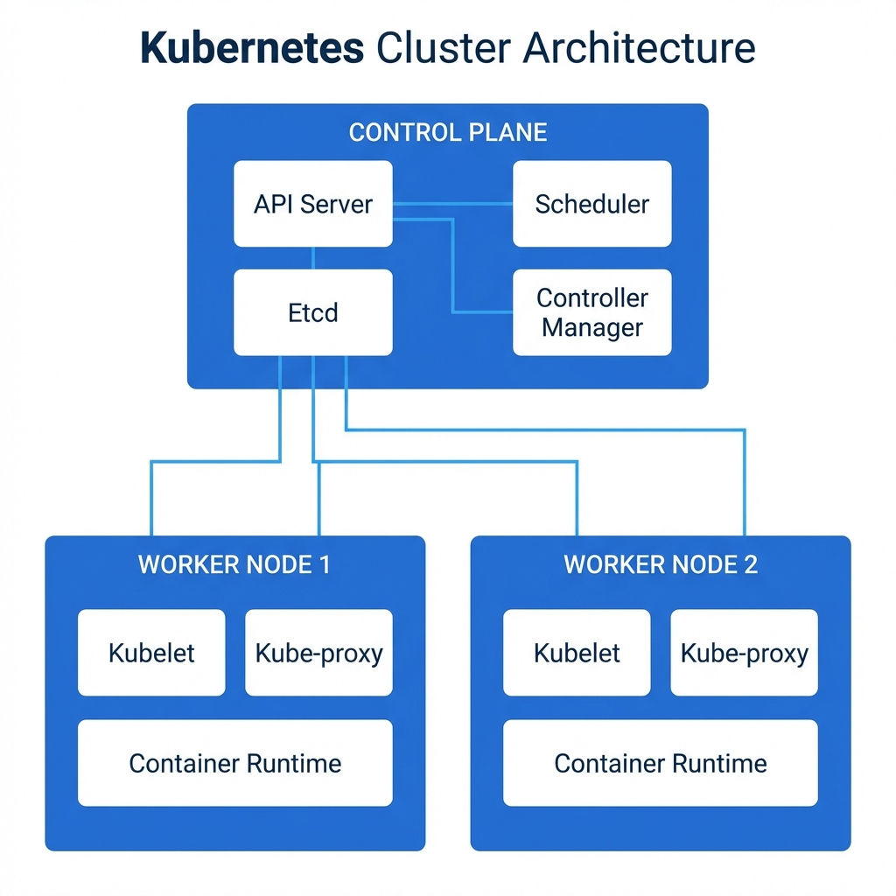
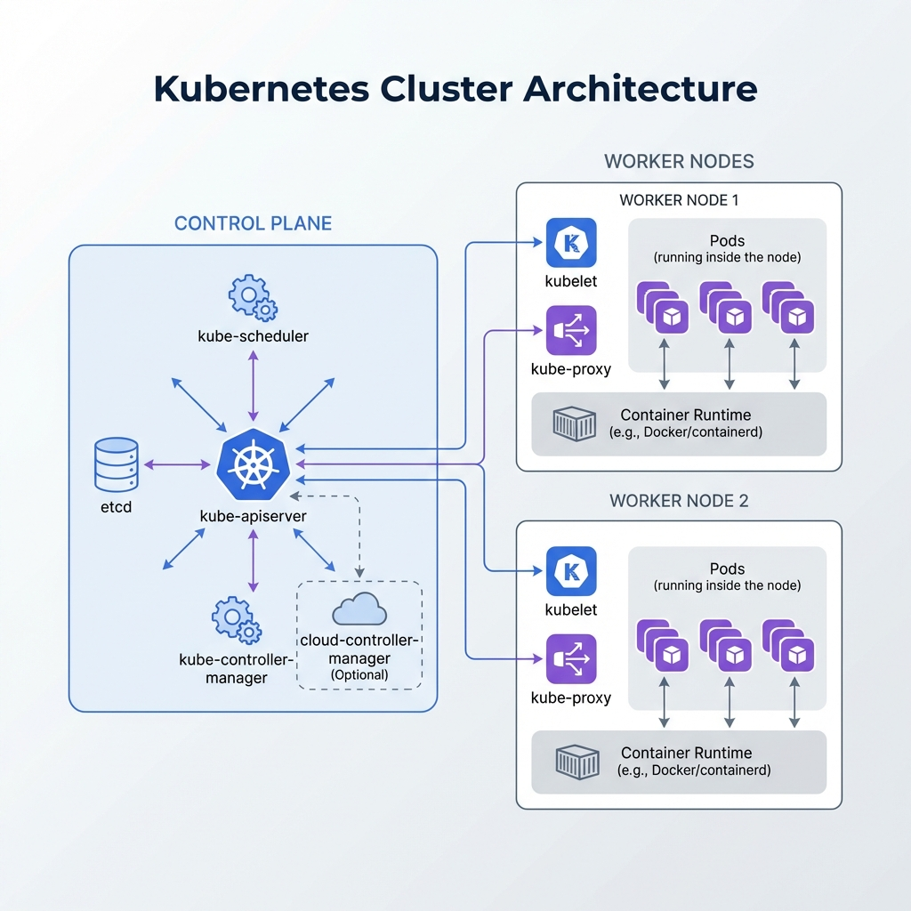
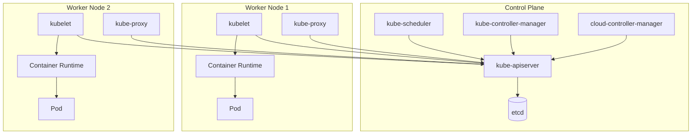
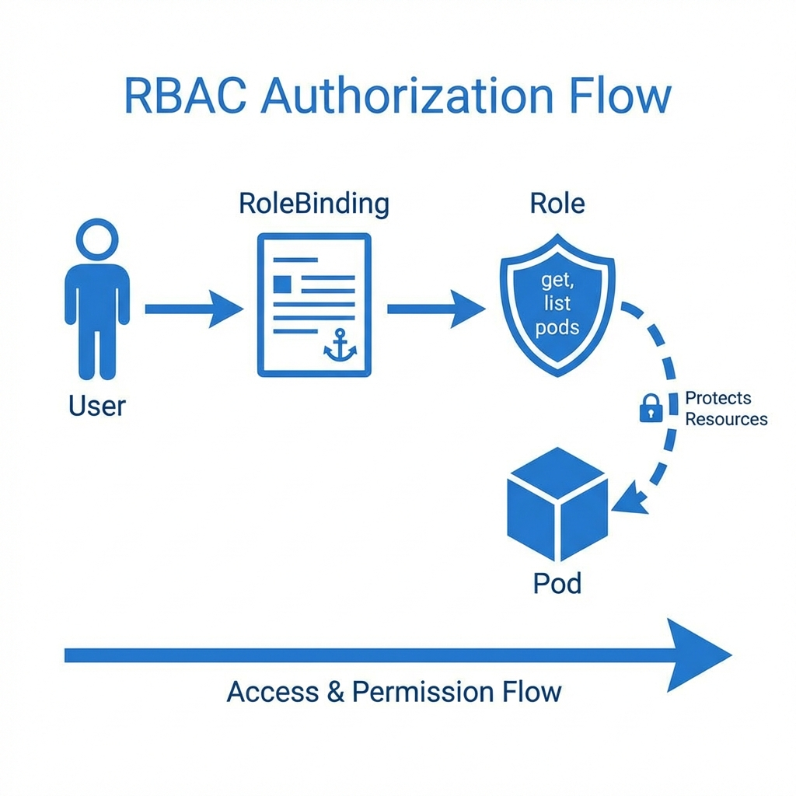
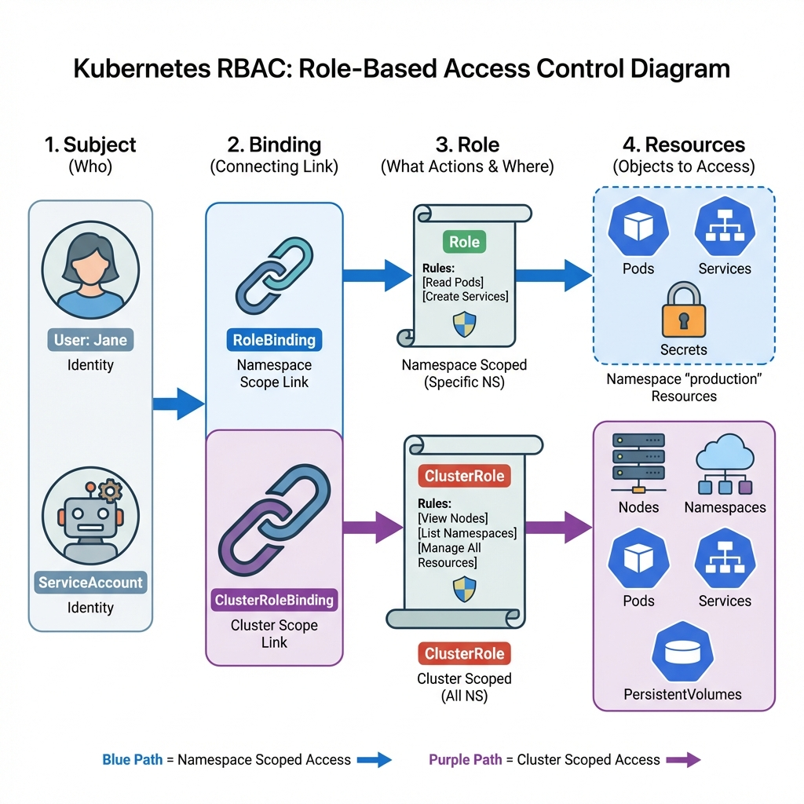
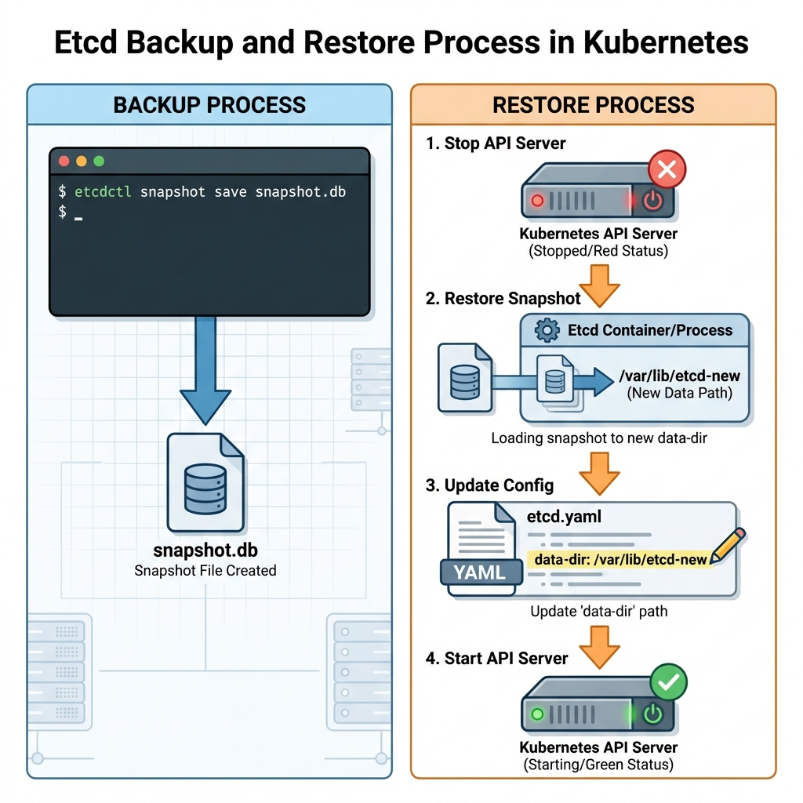
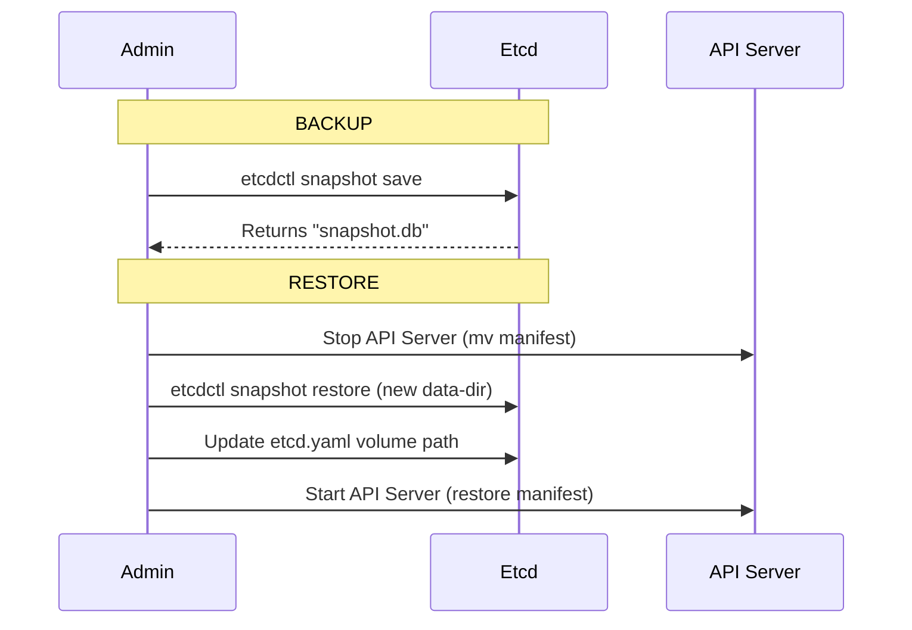

# Cluster Architecture, Installation & Configuration (25%)



## Topic Overview

This domain tests your understanding of the cluster's internal components, how to install/upgrade a cluster, and how to manage access via RBAC.

## Key Concepts

### Cluster Architecture

Below is a high-level view of how Kubernetes components interact.




<!--

-->

### Control Plane Components
The Control Plane creates the global decisions for the cluster (scheduling, detecting/responding to events).

- **kube-apiserver**: 
  - The "brain" and entry point for all REST commands. All other components (scheduler, controller-manager, kubelet, kubectl) talk *only* to the API Server; they do not talk to each other directly.
  - Validates and configures data for objects (Pods, Services, etc.).
  - The only component that writes to `etcd`.
- **etcd**: 
  - Consistent and highly-available key-value store used as Kubernetes' backing store for all cluster data.
  - Stores the state of the cluster (what nodes exist, what pods are running, configmaps, secrets).
  - *Note*: Always have a backup plan for etcd data!
- **kube-scheduler**: 
  - Watches for newly created Pods with no assigned node.
  - Selects the best node for them to run on based on resource requirements, hardware/software/policy constraints, affinity and anti-affinity specifications, etc.
- **kube-controller-manager**: 
  - Runs controller processes that regulate the state of the system.
  - Includes: 
    - **Node Controller**: Notices and responds when nodes go down.
    - **Replication Controller**: Maintains the correct number of pods.
    - **EndpointSlice Controller**: Populates EndpointSlice objects (for Services).
    - **ServiceAccount & Token Controllers**: Create default accounts and API access tokens for new namespaces.
- **cloud-controller-manager**: 
  - Embeds cloud-specific control logic (only relevant if running on AWS, Azure, GCP, etc.).
  - Links your cluster into the cloud provider's API (e.g., creating LoadBalancers, managing storage volumes).

### Worker Node Components
Worker nodes run your actual applications (Pods).

- **kubelet**: 
  - An agent that runs on each node.
  - Registers the node with the API server.
  - Takes a set of PodSpecs (primarily from the API server) and ensures that the containers described in those PodSpecs are running and healthy.
  - Does *not* manage containers not created by Kubernetes.
- **kube-proxy**: 
  - Maintains network rules on nodes.
  - Implements the Service abstraction allowing network communication to your Pods from inside or outside of the cluster.
  - Uses OS packet filtering layers (like iptables or IPVS).
- **Container Runtime**: 
  - The software responsible for starting and running containers.
  - Examples: **containerd**, **CRI-O**, Docker Engine (via cri-dockerd).
  - Kubernetes connects to it via the Container Runtime Interface (CRI).

### RBAC (Role-Based Access Control)


RBAC controls "who can do what to whom".

```mermaid
graph LR
    User(User / ServiceAccount) -- assigned to --> Bind(Binding)
    Bind -- references --> Role(Role)
    Role -- contains --> Rules[Rules / Permissions]
    Rules -- apply to --> Resources[Resources (Pod, Svc)]
```



- **Role**: Defines permissions (rules) within a specific **namespace**.
- **ClusterRole**: Defines permissions across the **entire cluster** (or for non-namespaced resources like Nodes).
- **RoleBinding**: Grants the permissions defined in a Role to a User/Group within a specific namespace.
- **ClusterRoleBinding**: Grants the permissions defined in a ClusterRole to a User/Group cluster-wide.

## Commands / Imperative Usage

### RBAC
```bash
# Create a Role
kubectl create role developer --verb=create,list,get --resource=pods

# Create a RoleBinding
kubectl create rolebinding dev-user-binding --role=developer --user=jane --namespace=default

# Check permissions (auth can-i)
kubectl auth can-i create pods --as=jane
```

### Kubeadm Upgrade (High Level)
1.  **Upgrade Control Plane Node**:
    - Unhold kubeadm: `apt-mark unhold kubeadm`
    - Install new version: `apt-get install -y kubeadm=1.27.x-00`
    - `kubeadm upgrade plan`
    - `kubeadm upgrade apply v1.27.x`
2.  **Upgrade Kubelet & Kubectl**:
    - `apt-get install -y kubelet=1.27.x-00 kubectl=1.27.x-00`
    - `systemctl daemon-reload && systemctl restart kubelet`

## Laboratory / Hands-on Steps

### 1. Etcd Backup & Restore
**Workflow Visualization**:




<!--

-->

**Backup**:
1.  **Snapshot the data**: Use `etcdctl` to save the current state.
    ```bash
    ETCDCTL_API=3 etcdctl \
      --endpoints=https://127.0.0.1:2379 \
      --cacert=/etc/kubernetes/pki/etcd/ca.crt \
      --cert=/etc/kubernetes/pki/etcd/server.crt \
      --key=/etc/kubernetes/pki/etcd/server.key \
      snapshot save /tmp/etcd-backup.db
    ```

**Restore**:
1.  **Stop the API Server**: Move the static pod manifest out of `/etc/kubernetes/manifests/` so the API server stops.
    ```bash
    mv /etc/kubernetes/manifests/kube-apiserver.yaml /tmp/
    ```
2.  **Restore the snapshot**: Restore to a *new* data directory to be safe.
    ```bash
    ETCDCTL_API=3 etcdctl snapshot restore /tmp/etcd-backup.db --data-dir /var/lib/etcd-restored
    ```
3.  **Update Deployment**: Edit the etcd manifest to point to the new data directory.
    ```bash
    vim /etc/kubernetes/manifests/etcd.yaml
    # Update hostPath for 'etcd-data' volume to: /var/lib/etcd-restored
    ```
4.  **Restart API Server**: Move the static pod manifest back.
    ```bash
    mv /tmp/kube-apiserver.yaml /etc/kubernetes/manifests/
    ```

## Useful Links
- [Operating etcd clusters](https://kubernetes.io/docs/tasks/administer-cluster/configure-upgrade-etcd/)
- [Using RBAC Authorization](https://kubernetes.io/docs/reference/access-authn-authz/rbac/)
