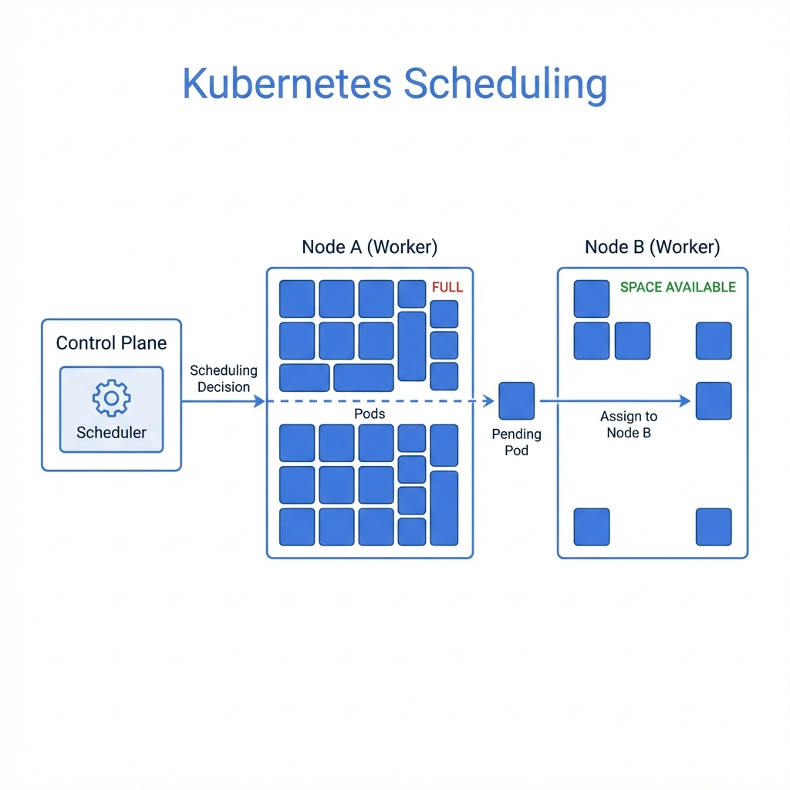
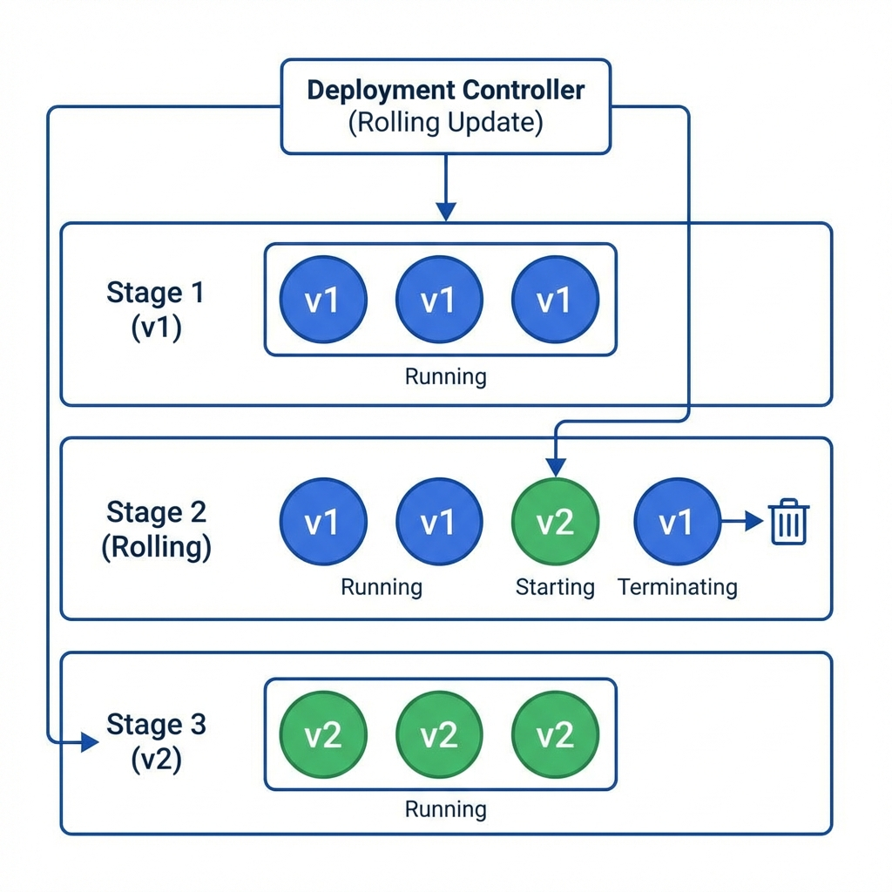

# Workloads & Scheduling (15%)



## Topic Overview

This domain focuses on the lifecycle of applications in Kubernetes, how they are scheduled on nodes, and the controllers that manage them.

## Key Concepts

### Pods & Multi-Container Pods
- **Pod**: The smallest deployable unit.
- **Sidecar**: Helper container (e.g., logging agent).
- **Ambassador**: Proxy for external connection.
- **Adapter**: Standardizes output.
- **InitContainers**: Runs before main containers; good for setup scripts.

### Deployments & Rolling Updates

- Manages strict stateless applications.

- **RollingUpdate**: Zero-downtime updates.
- **Rollback**: `kubectl rollout undo deploy/web`.

### Scheduling
- **NodeSelector**: Simple key-value matching.
- **Node Affinity**:
    - `requiredDuringSchedulingIgnoredDuringExecution` (Hard constraint)
    - `preferredDuringSchedulingIgnoredDuringExecution` (Soft constraint)
- **Taints & Tolerations**:
    - **Taint** on Node: "No pod can land here unless..."
    - **Toleration** on Pod: "...I have a special ticket (toleration)."
    - Effect: `NoSchedule`, `PreferNoSchedule`, `NoExecute`.

### ConfigMaps & Secrets
- **ConfigMap**: Non-sensitive data (env vars, config files).
- **Secret**: Encoded data (passwords, keys). Base64 encoded, NOT encrypted by default.

## Commands / Imperative Usage

### Pods
```bash
# Create a pod
kubectl run nginx --image=nginx --restart=Never

# Create a pod with specific labels
kubectl run nginx --image=nginx --restart=Never --labels="app=web,env=prod"

# Dry run to generate YAML
kubectl run redis --image=redis --restart=Never --dry-run=client -o yaml > redis.yaml
```

### Deployments
```bash
# Create a deployment
kubectl create deploy web --image=nginx --replicas=3

# Scale a deployment
kubectl scale deploy web --replicas=5
```

### Scheduling & Taints
```bash
# Label a node
kubectl label node worker-1 disktype=ssd

# Taint a node
kubectl taint node worker-1 key=value:NoSchedule

# Check taints
kubectl describe node worker-1 | grep Taint
```

## Laboratory / Hands-on Steps

### 1. Multi-Container Pod
Create a pod with a legacy application and a sidecar that reads logs.
```yaml
apiVersion: v1
kind: Pod
metadata:
  name: sidecar-test
spec:
  containers:
  - name: main
    image: busybox
    command: ["sh", "-c", "while true; do echo 'Log time' >> /var/log/app.log; sleep 5; done"]
    volumeMounts:
    - name: logs
      mountPath: /var/log
  - name: sidecar
    image: busybox
    command: ["sh", "-c", "tail -f /var/log/app.log"]
    volumeMounts:
    - name: logs
      mountPath: /var/log
  volumes:
  - name: logs
    emptyDir: {}
```

### 2. Node Affinity
Ensure a pod only runs on a node with label `size=large`.
```yaml
spec:
  affinity:
    nodeAffinity:
      requiredDuringSchedulingIgnoredDuringExecution:
        nodeSelectorTerms:
        - matchExpressions:
          - key: size
            operator: In
            values:
            - large
```

## Useful Links
- [Assigning Pods to Nodes](https://kubernetes.io/docs/concepts/scheduling-eviction/assign-pod-node/)
- [Taints and Tolerations](https://kubernetes.io/docs/concepts/scheduling-eviction/taint-and-toleration/)
