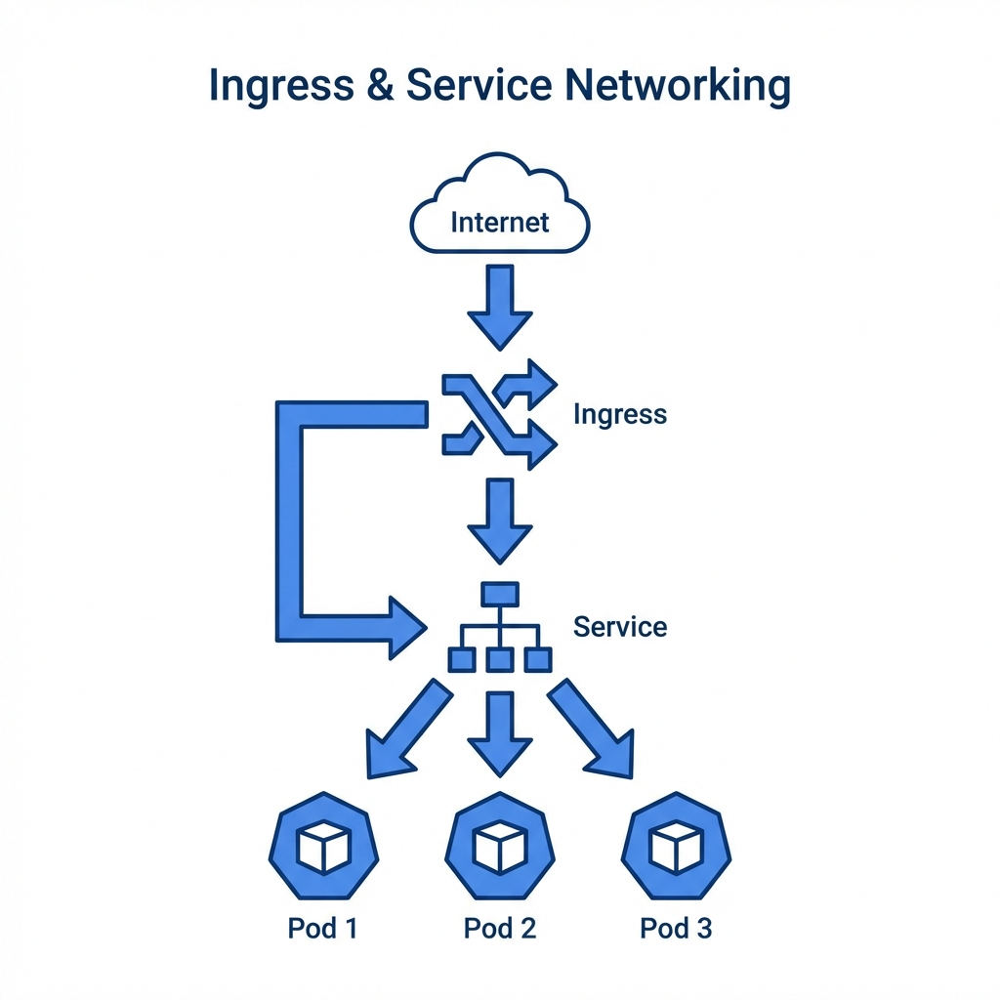
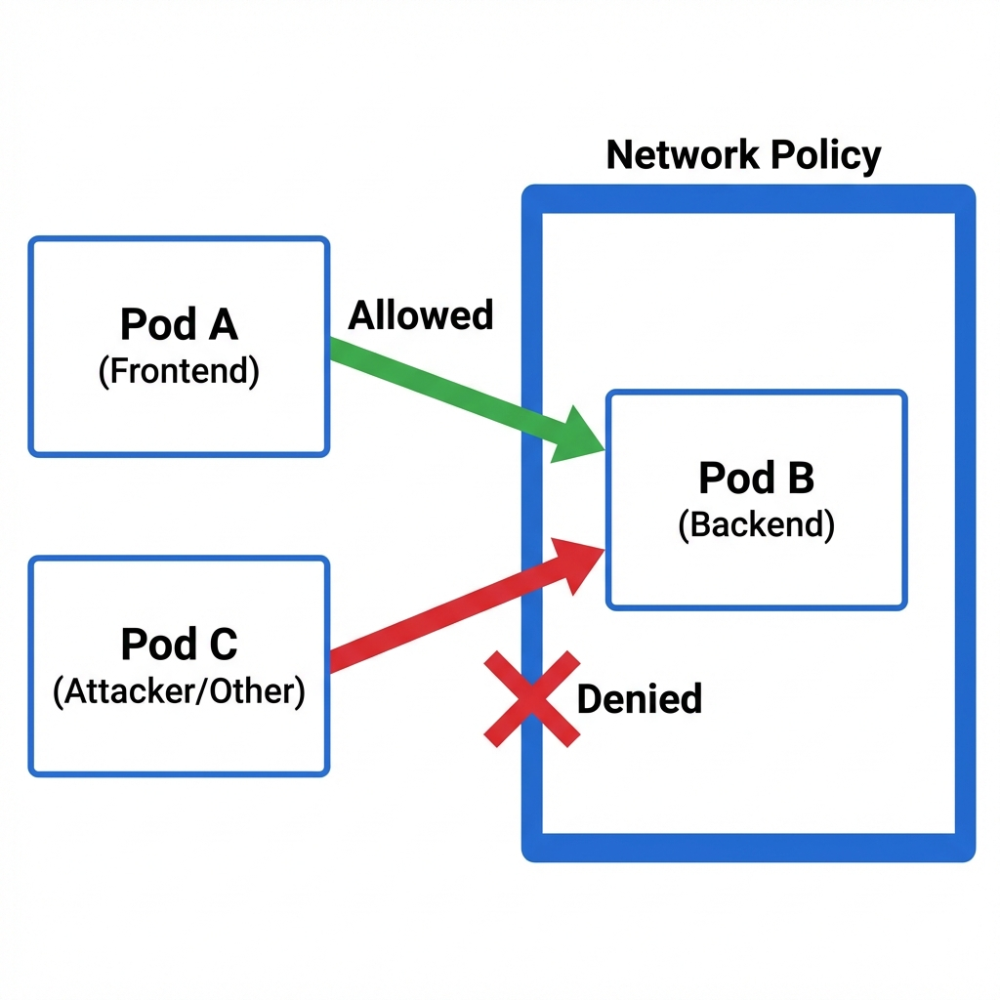

# Services & Networking (20%)



## Topic Overview

This section covers how pods communicate with each other and how external traffic reaches applications.

## Key Concepts

### Services
- **ClusterIP**: Exposes the service on an internal IP. Default.
- **NodePort**: Exposes the service on each Node's IP at a static port.
- **LoadBalancer**: Exposes the service externally using a cloud provider's load balancer.
- **ExternalName**: Maps the service to the contents of the `externalName` field (e.g. `foo.bar.example.com`).

### Ingress
- Manages external access to services (HTTP/HTTPS).
- Requires an **Ingress Controller** to be running (e.g., NGINX).
- Supports path-based routing (`/api` vs `/web`).

### Network Policies

- Controls traffic flow at the IP address or port level.

- **Default Deny**: Good security practice to deny all ingress traffic and allow specific paths.

### DNS
- **CoreDNS**: The DNS server for the cluster.
- Service DNS format: `<service-name>.<namespace>.svc.cluster.local`

## Commands / Imperative Usage

### Services
```bash
# Expose a deployment as a ClusterIP service
kubectl expose deploy web --name=web-svc --port=80 --target-port=80

# Expose as NodePort
kubectl expose deploy web --name=web-nodeport --type=NodePort --port=80
```

### Ingress
```bash
# Create an ingress (imperative create ingress is available in newer versions)
kubectl create ingress simple --rule="foo.com/bar=svc1:8080"
```

## Laboratory / Hands-on Steps

### 1. Ingress Resource
Create an Ingress that routes `foo.com` to `service1` and `bar.com` to `service2`.

```yaml
apiVersion: networking.k8s.io/v1
kind: Ingress
metadata:
  name: minimal-ingress
spec:
  rules:
  - host: "foo.com"
    http:
      paths:
      - pathType: Prefix
        path: "/"
        backend:
          service:
            name: service1
            port:
              number: 80
  - host: "bar.com"
    http:
      paths:
      - pathType: Prefix
        path: "/"
        backend:
          service:
            name: service2
            port:
              number: 80
```

### 2. Network Policy (Deny All)
Isolate a namespace by denying all incoming traffic.

```yaml
apiVersion: networking.k8s.io/v1
kind: NetworkPolicy
metadata:
  name: default-deny-all
  namespace: default
spec:
  podSelector: {}
  policyTypes:
  - Ingress
```

## Useful Links
- [Ingress](https://kubernetes.io/docs/concepts/services-networking/ingress/)
- [Network Policies](https://kubernetes.io/docs/concepts/services-networking/network-policies/)
