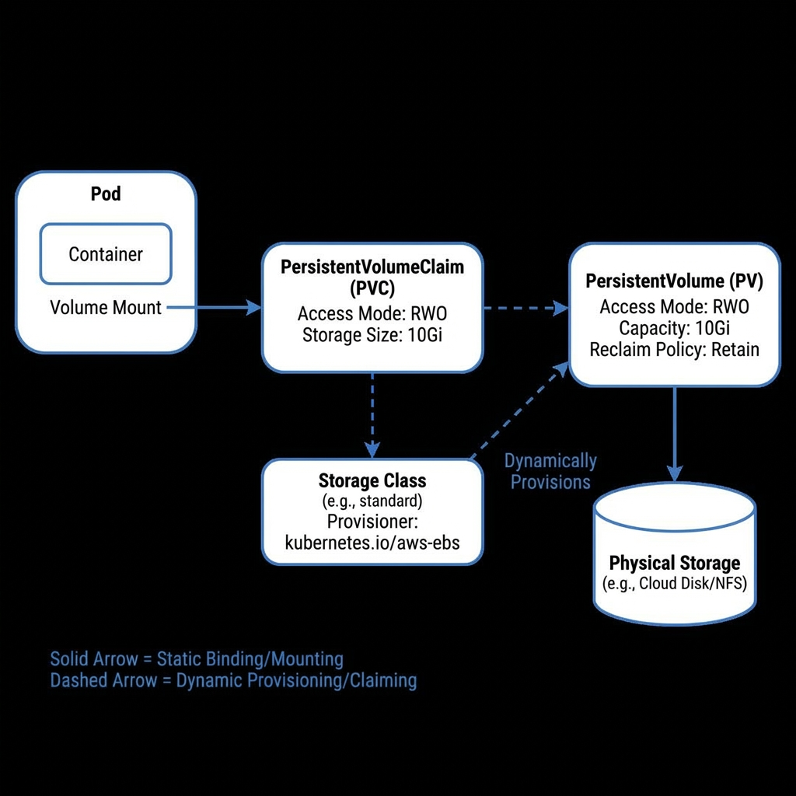

# Storage (10%)



## Topic Overview

Persistent storage is crucial for stateful applications. This domain covers how to provision and consume storage in Kubernetes.

## Key Concepts

### Storage Primitives
- **PersistentVolume (PV)**: A piece of storage in the cluster that has been provisioned by an administrator or dynamically through Storage Classes.
- **PersistentVolumeClaim (PVC)**: A request for storage by a user.
- **StorageClass**: Describes the "classes" of storage offered (e.g., 'fast', 'slow'). Enables dynamic provisioning.

### Access Modes
- **ReadWriteOnce (RWO)**: Mounted by a single node as read-write.
- **ReadOnlyMany (ROX)**: Mounted by multiple nodes as read-only.
- **ReadWriteMany (RWX)**: Mounted by multiple nodes as read-write.

### Volume Modes
- **Filesystem**: Default. Mounted as a directory.
- **Block**: Raw block device.

## Commands / Imperative Usage

### PV & PVC (Mostly YAML based)
```bash
# Get storage classes
kubectl get sc

# Get PVs and PVCs
kubectl get pv,pvc --all-namespaces
```

## Laboratory / Hands-on Steps

### 1. Create a PV
```yaml
apiVersion: v1
kind: PersistentVolume
metadata:
  name: pv001
spec:
  capacity:
    storage: 1Gi
  accessModes:
    - ReadWriteOnce
  hostPath:
    path: "/mnt/data"
```

### 2. Create a PVC
```yaml
apiVersion: v1
kind: PersistentVolumeClaim
metadata:
  name: my-pvc
spec:
  accessModes:
    - ReadWriteOnce
  resources:
    requests:
      storage: 500Mi
```

### 3. Mount PVC in a Pod
```yaml
apiVersion: v1
kind: Pod
metadata:
  name: my-pod
spec:
  containers:
    - name: my-frontend
      image: nginx
      volumeMounts:
      - mountPath: "/usr/share/nginx/html"
        name: my-pd
  volumes:
    - name: my-pd
      persistentVolumeClaim:
        claimName: my-pvc
```

## Useful Links
- [Configure a Pod to Use a PersistentVolume for Storage](https://kubernetes.io/docs/tasks/configure-pod-container/configure-persistent-volume-storage/)
