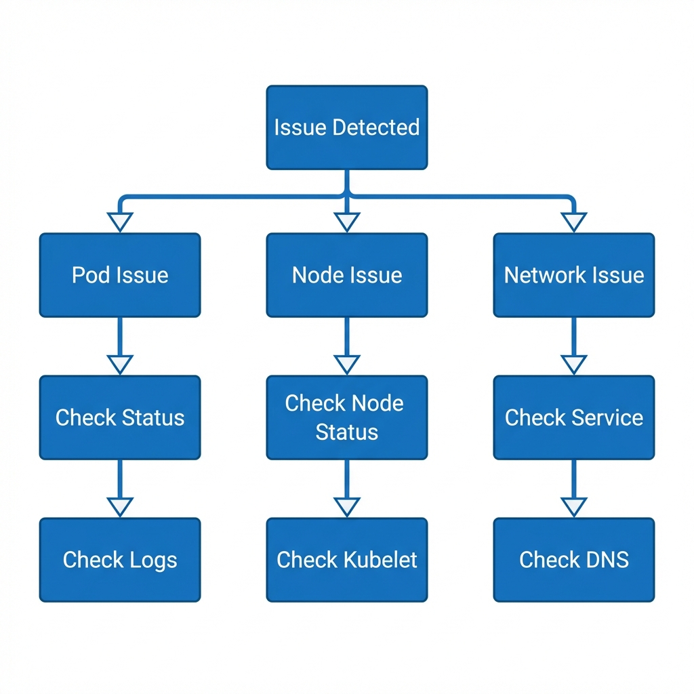

# Troubleshooting (30%)



## Topic Overview

This is the most critical section of the exam. You must be able to diagnose and fix broken clusters and applications efficiently.

## Key Concepts

### Cluster Troubleshooting
- **Node Status**: `NotReady` often means `kubelet` is down or CNI is misconfigured.
- **Component Status**: Check control plane pods in `kube-system`.

### Application Troubleshooting
- **ImagePullBackOff**: Wrong image name, tag, or auth issue.
- **CrashLoopBackOff**: App is crashing (check logs/code).
- **Pending**: No resources available, taint issues, or PVC not bound.

## Commands / Imperative Usage

### Debugging Cluster
```bash
# Check node details
kubectl describe node worker-1

# Check kubelet service on the node
systemctl status kubelet
journalctl -u kubelet -f
```

### Debugging Pods
```bash
# Check events
kubectl describe pod my-pod

# Check logs (current)
kubectl logs my-pod

# Check logs (previous instance if crashed)
kubectl logs my-pod --previous

# Exec into pod
kubectl exec -it my-pod -- sh
```

### Network Debugging
```bash
# Check DNS
kubectl run busybox --image=busybox:1.28 --restart=Never -- nslookup kubernetes
```

## Laboratory / Hands-on Steps

### 1. Fix a Broken Node
*Scenario*: Worker node is `NotReady`.
1.  Notice `NotReady` status: `kubectl get nodes`
2.  SSH into node: `ssh worker-1`
3.  Check kubelet: `systemctl status kubelet`
4.  If stopped: `systemctl start kubelet`
5.  If running but failing, check logs: `journalctl -u kubelet`
6.  Look for config errors (e.g. incorrect client-ca-file path).

### 2. Fix a Broken Pod
*Scenario*: Pod is in `CrashLoopBackOff`.
1.  Check status: `kubectl get pod`
2.  Check logs: `kubectl logs web-pod`
3.  See error "File not found /config/app.conf".
4.  Realize you forgot to mount the ConfigMap.
5.  Edit pod: `kubectl edit pod web-pod` (or delete and re-apply corrected YAML).

## Useful Links
- [Troubleshooting Clusters](https://kubernetes.io/docs/tasks/debug-application-cluster/debug-cluster/)
- [Debug Running Pods](https://kubernetes.io/docs/tasks/debug-application-cluster/debug-running-pod/)
